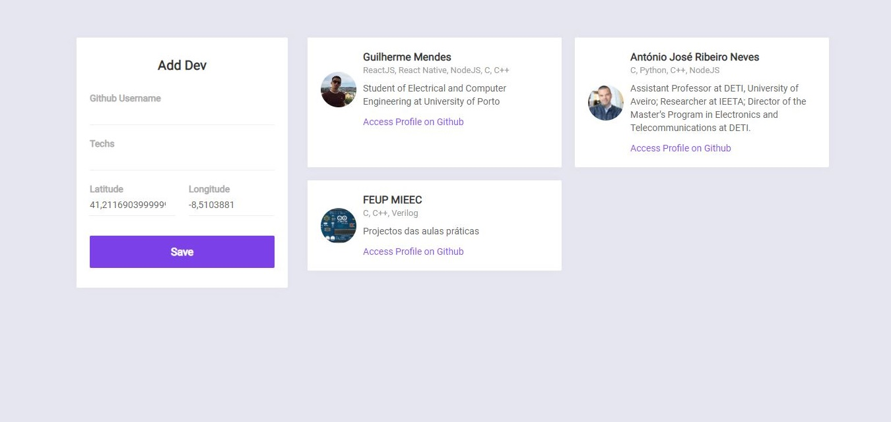

# github-tracker-app
A simple application that geographically locates programmers near you, using technologies or programming languages.

<ul>
  This application was created with:
  <li>nodejs for the backend with the Express framework,</li>
  <li>MongoDB as database,</li>
  <li>ReactJS for the frontend</li>
  <li>React Native for the mobile application using Expo</li>
</ul>

<h3>Printscreens</h3>

Initial page

Finding developers with the C programming language

With a click on avatar, show us a small info about the user

If we click on the info, it opens the user's profile

This is the users register form

